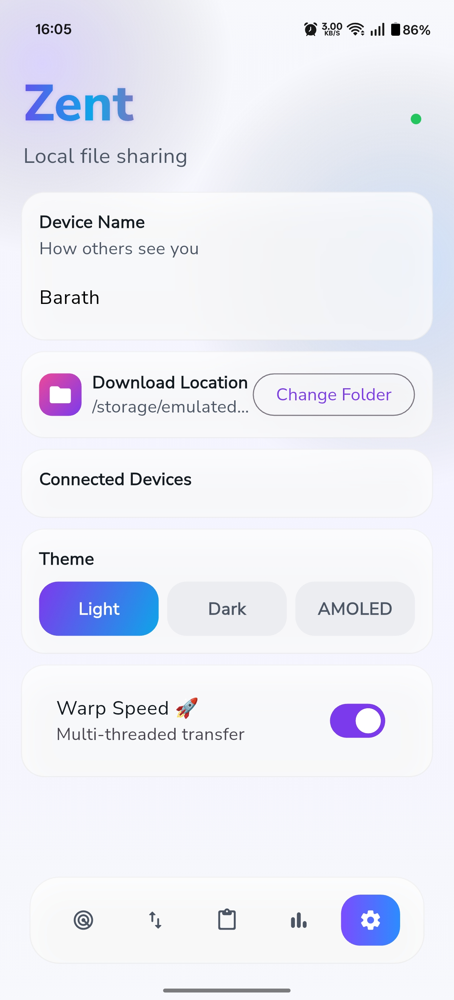
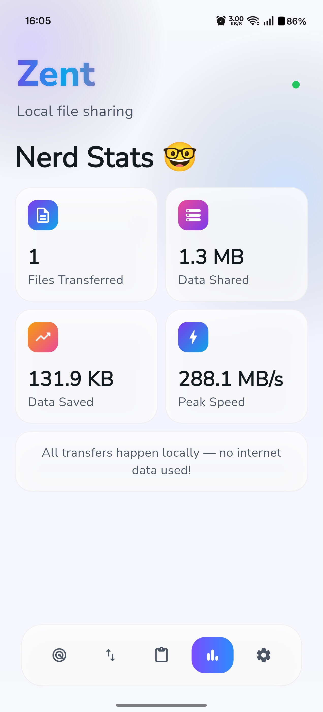
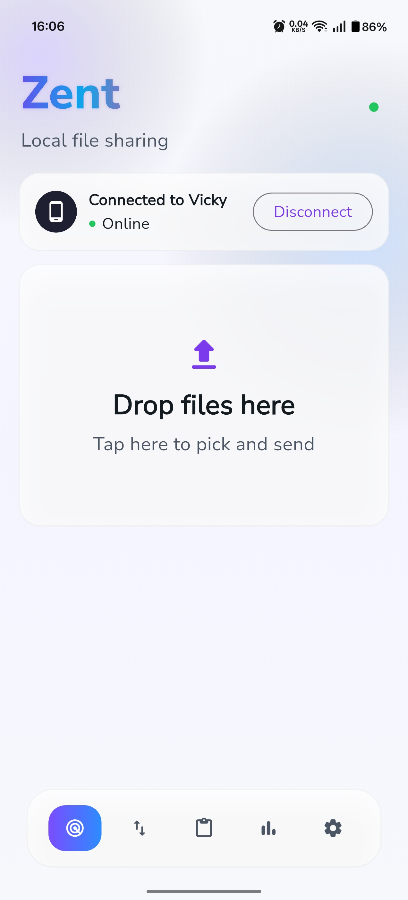
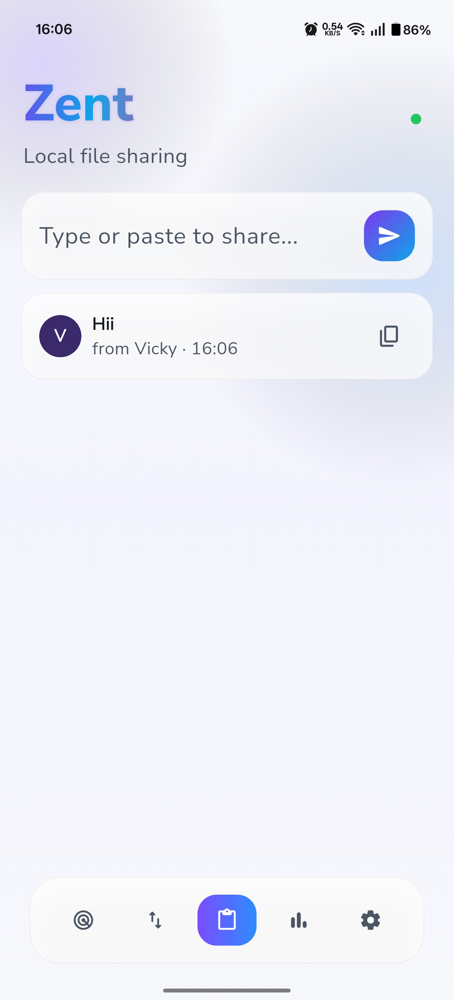
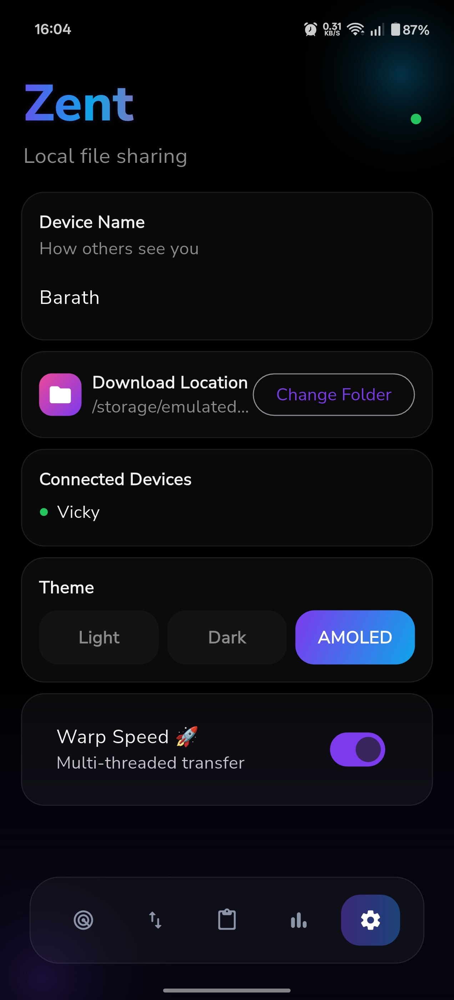
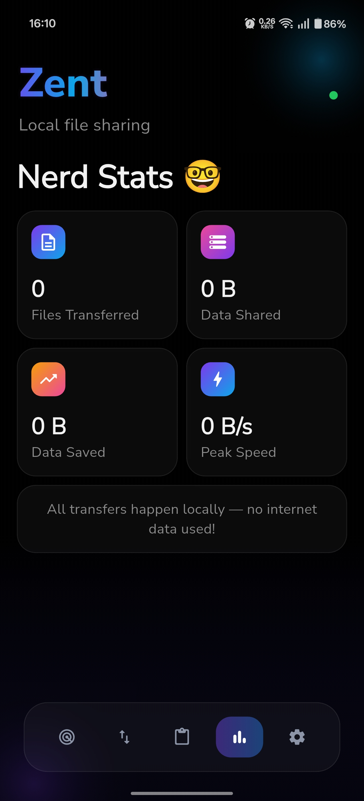
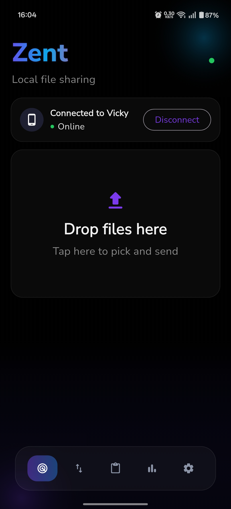
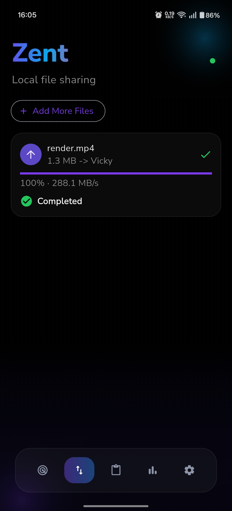

🚀 Zentflow

100% Offline • Peer-to-Peer • Lightning Fast File Sharing

Zentflow is a sleek, modern file sharing app built with Flutter that lets you transfer files instantly over local WiFi — no internet required, no cloud, no nonsense.

✨ Features

⚡ Ultra-fast transfers over local WiFi

📡 Peer-to-peer connection (no server needed)

🔒 Completely offline & private

📂 Send any file type

🔁 Reliable transfers with retry support

🎯 Simple & clean UI (PicsArt-inspired)

🌐 Cross-platform support

Android
Linux

📸 Screenshots

  
  
  
  

  
  
  
  

🛠️ Tech Stack

Flutter – Cross-platform UI
Dart – Core logic
Local WiFi Networking – Device-to-device communication

📦 Installation

🔹 Clone the repo
git clone https://github.com/Barath702/zentflow.git
cd zentflow
🔹 Install dependencies
flutter pub get
🔹 Run the app
flutter run
🧠 How It Works
Connect both devices to the same WiFi network
Open Zentflow on both devices
One device sends, the other receives
Files transfer instantly ⚡
🚧 Upcoming Features
⏸️ Pause / Resume transfers
📋 Clipboard sharing
🎨 Themes & customization
📊 Transfer statistics
🔗 Multi-device support
🤝 Contributing

Contributions are welcome!
Feel free to fork the repo and submit a pull request.

⭐ Support

If you like Zentflow, consider giving it a ⭐ on GitHub — it helps a lot!
